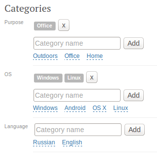

Quickstart
==========

.. note::

    Add the **sitecats** application to INSTALLED_APPS in your settings file (usually 'settings.py').

Let's allow categorization for ``Article`` model.

1. First, inherit that model from **sitecats.models.ModelWithCategory**.

2. Then we need to add at least one root category, to show up in our categories editor.

   Let's create two root categories with `language` and `os` aliases. This could be done either programmatically
   (instantiate `Category` model) or with Django Admin Contrib (install django-admirarchy_
   to simplify navigation).

3. Now to our views:

.. code-block:: python

    # Somewhere in views.py
    from django.shortcuts import render, get_object_or_404

    # `Article` model has sitecats.models.ModelWithCategory class mixed in.
    from .models import Article

    def article_details(self, request, article_id):
        """Nothing special in this view, yet it'll render a page with categories for our articles."""

        article = get_object_or_404(Article, pk=article_id)

        # Let's configure our category lists a little bit:
        # * show titles of parent categories,
        # * apply Twitter Bootstrap 3 css classes to categories.
        article.set_category_lists_init_kwargs({
            'show_title': True,
            'cat_html_class': 'label label-default'
        })

        return self.render(request, 'article.html', {'article': article})

    def article_edit(self, request, article_id):
        """This time we allow the view to render and handle categories editor."""
        article = get_object_or_404(Article, pk=article_id)

        # Now we enable category editor for an article, and allow users
        # to add subcategories of `language`, and `os` categories and link articles to them.
        article.enable_category_lists_editor(
            request,
            editor_init_kwargs={'allow_new': True},
            lists_init_kwargs={
                'show_title': True,
                'cat_html_class': 'label label-default'
            },
            additional_parents_aliases=['language', 'os']
        )

        form = ... # Your usual Article edit handling code will be here.

        return render(request, 'article.html', {'article': article, 'form': form})

4. Template coding basically boils down to ``sitecats_categories`` template tags usage:

.. code-block:: html

    <!-- article.html
         The same html is just fine for demonstration purposes for both our views.
         Do not forget to load `sitecats` template tags library. -->
    
    

    
        <!-- Some additional functionality (e.g. categories cloud rendering,
             editor enhancements) will require JS. -->
        

        <h1>{{ article.title }}</h1>
        

             <!-- And that's it. -->
        

        <!-- Form code goes somewhere here. -->
    

Add some categories.

That's roughly what we could have on details page:

And on edit page:

.. _django-admirarchy: https://github.com/idlesign/django-admirarchy
